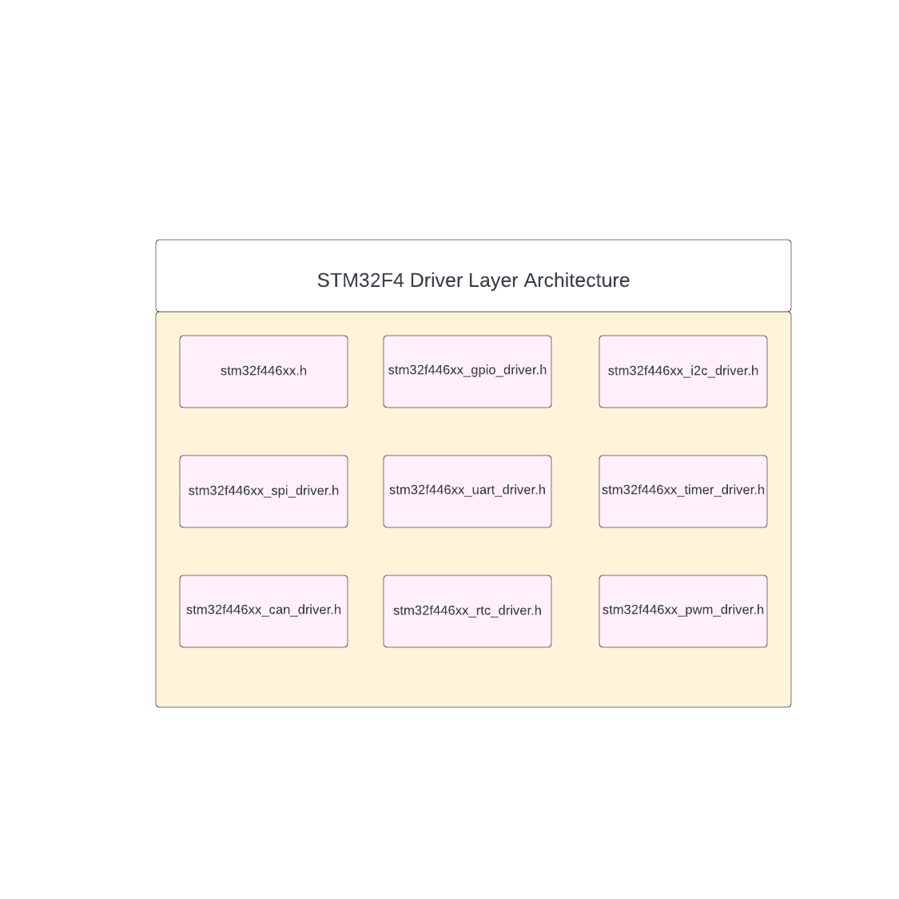
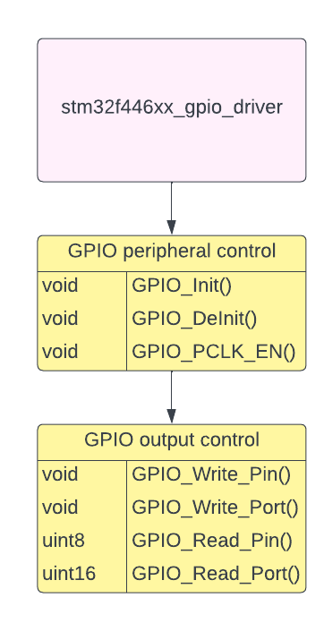

# STM32F4_Driver
- This repo contains is peripheral driver for the stm32f4 series based on CMSIS standard
## The Diagram below shown a full driver layer of the STM32F4 series that I'd built  

### STM32F446xx 
- This driver contain STM32F4 series for controlling other drivers peripheral.
### GPIO driver 
- GPIO driver is use for controlling GPIO peripheral in the STM32F4 series 
- It contain APIs like: GPIO_Write_Pin, GPIO_Read_Pin, GPIO_Write_Port, GPIO_Read_Port, GPIO_IQR  

