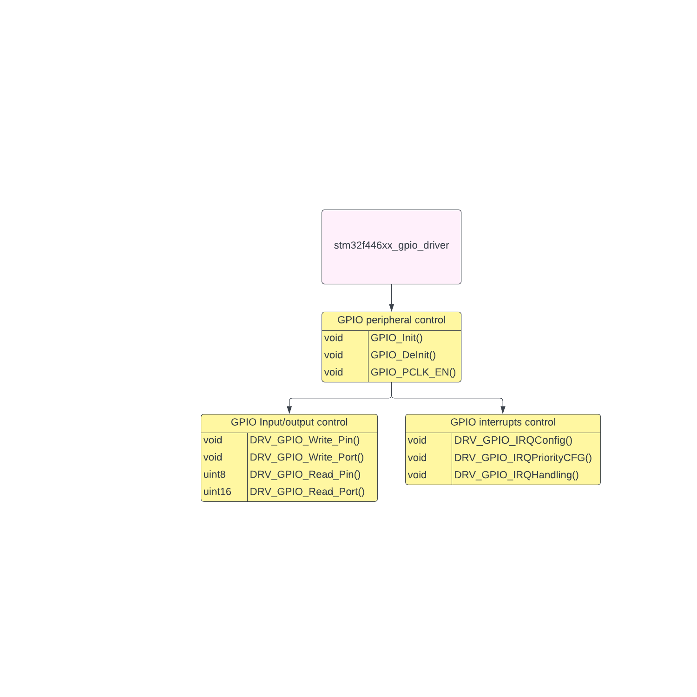

# STM32F4_Driver
- This repo contains is peripheral driver for the stm32f4 series based on CMSIS standard
## The Diagram below shown a full driver layer of the STM32F446xx series that I had built  
### STM32F446xx 

- This driver contain STM32F446xx series for controlling other drivers peripheral.
- It also contain peripheral base address, control macros,...
### GPIO driver 

- GPIO driver is use for controlling GPIO peripheral in the STM32F446xx series 
- It contain APIs: GPIO_Write_Pin, GPIO_Read_Pin, GPIO_Write_Port, GPIO_Read_Port, GPIO_IQR  

### SPI driver 

- SPI driver is use for controlling SPI peripheral in the STM32F446xx series 
- It contain APIs: DRV_SPI_Transmit, DRV_SPI_Receive, DRV_SPI_Transmit_IT, DRV_SPI_Receive_IT, DRV_SPI_Transmit_DMA, DRV_SPI_Receive_IT  
